# ProofChain — Blockchain Anchored Digital Forensic Evidence Platform and AI POWERED TAMPER DETECTION

Welcome to **ProofChain**, a web application designed to secure digital forensic evidence. 

In digital forensics, proving that a file (like a photo, video, or document) has not been tampered with or edited is critical. ProofChain acts as a **digital notary**. It locks files in place using advanced mathematics and blockchain technology, ensuring they remain exactly as they were when collected, and tracking every person who handles them.

---

## 🎨 Visual Tour (Screenshots & Interface)

Below is an interactive look at the platform. We have captured each key part of the application to show how it functions and how the features look in practice.

### 🌐 1. Guest Experience & Access
| Section | Preview | Description |
| :--- | :---: | :--- |
| **Landing Page Hero** | 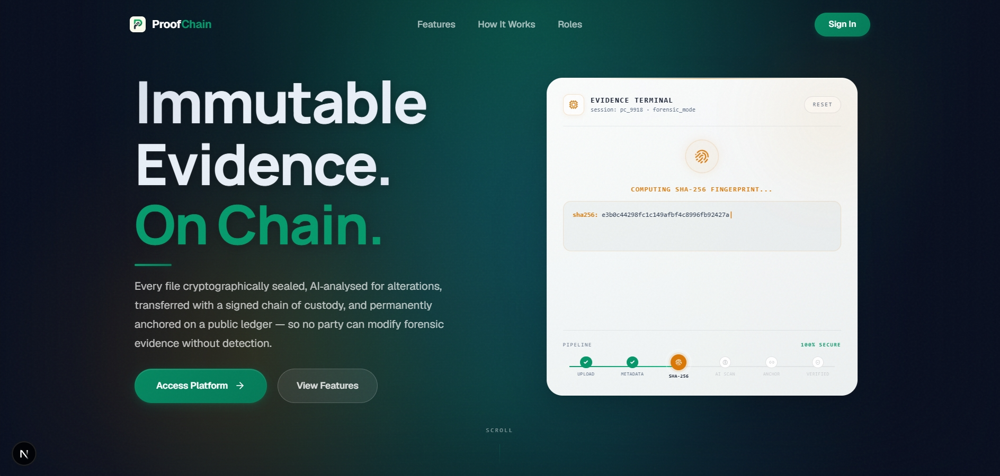 | **The Front Gate**: A modern, interactive dark-themed landing page. It introduces the project and features a live simulated playground widget that demonstrates cryptographic hash sealing right on the screen. |
| **Trust & Metrics** | 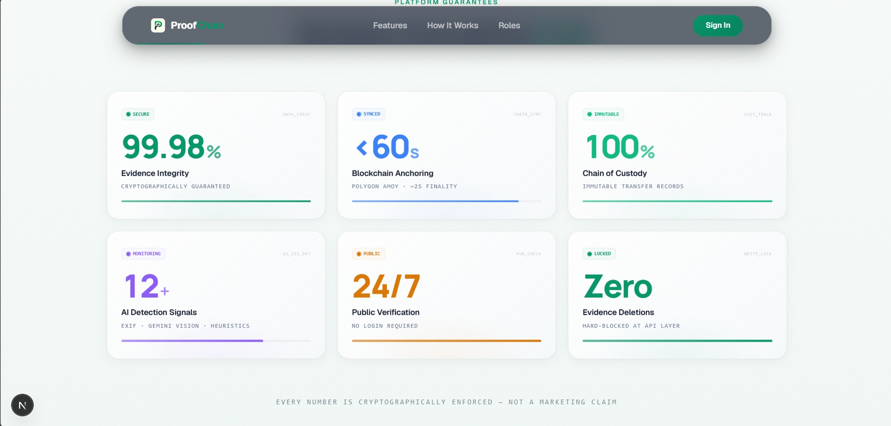 | **Real-Time Statistics**: A visual breakdown showing the overall health of the platform, including active cases, sealed files, block sync status, and verification metrics. |
| **How It Works** | 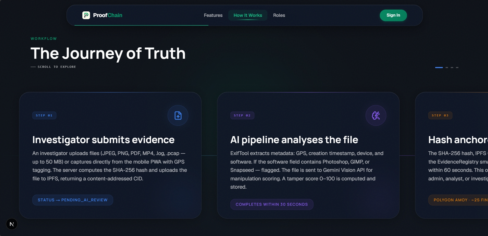 | **Feature Highlights**: A clean, responsive list of cards explaining the three steps of the platform: (1) Sealing files locally, (2) Anchoring them to the blockchain, and (3) Verifying them publicly. |
| **Secure Login** | 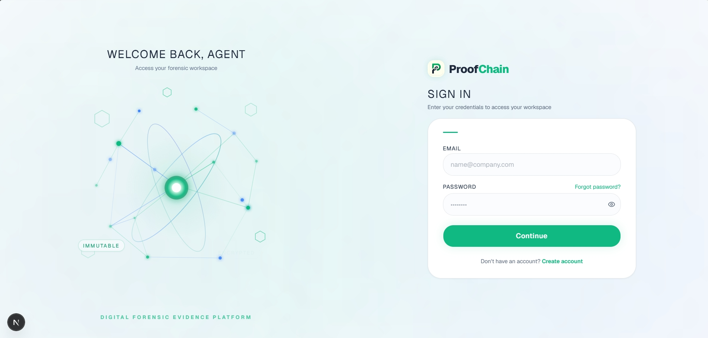 | **User Portal**: A secure login page with visual cues like capslock warnings, smooth animations, and a helper panel to switch between dashboards easily. |

---

### 🕵️‍♂️ 2. Investigator Workflows
| Section | Preview | Description |
| :--- | :---: | :--- |
| **Investigator Dashboard** | 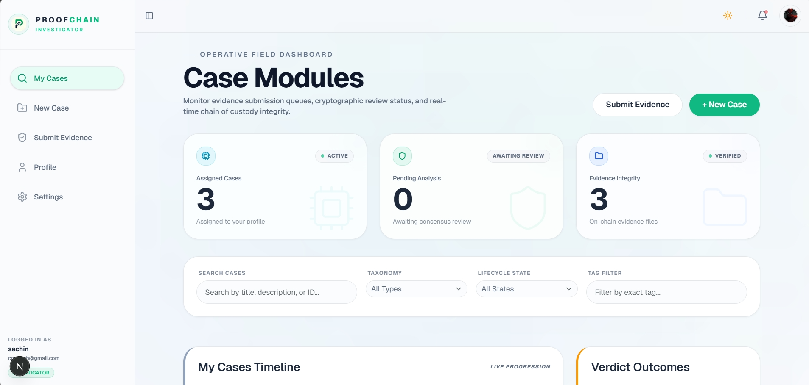 | **Control Center**: Investigators can see case summaries, open case counts, active tasks, and a searchable database of all their submitted forensic cases. |
| **Evidence Submission** | 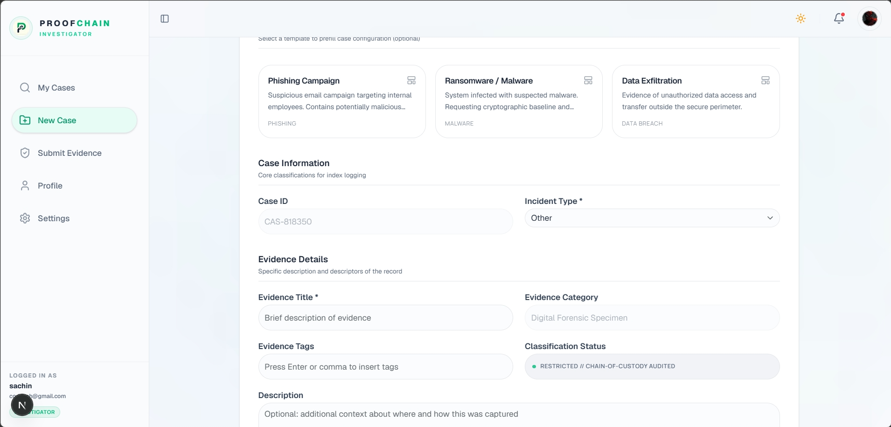 | **Sealing Evidence**: A clean form where investigators input case details, incident categories, device origins, and drop files. The page calculates the cryptographic fingerprint (hash) instantly upon file selection. |
| **Evidence Profile (Seal)** | 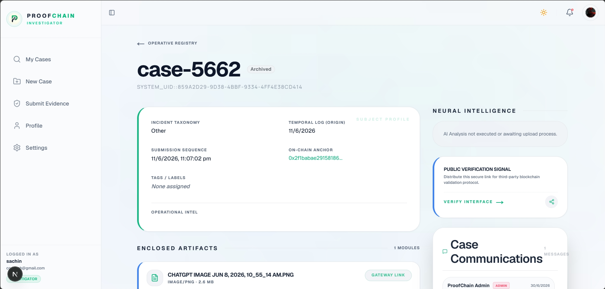 | **The Digital Seal**: Inside a case, each file gets a detailed page. It displays the file size, type, custom tags, security risk analysis, and its official transaction hash on the blockchain. |
| **Geographic Route & Timeline** | 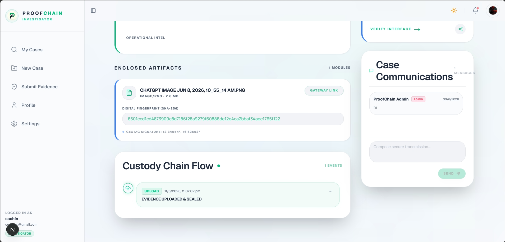 | **Chain of Custody Tracking**: Shows exactly where the files were captured on an interactive map. Below the map, a vertical timeline tracks every user who viewed, edited, or transferred the file. |

---

### 🔍 3. Forensic Analysis & Security Controls
| Section | Preview | Description |
| :--- | :---: | :--- |
| **Public Verification Stand** | 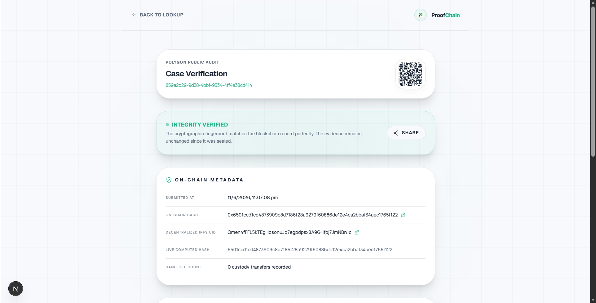 | **Independent Verification**: A page accessible to anyone (like court officers or clients) by clicking the QR code link. It checks the live blockchain state to verify if the file matches the official seal. |
| **Forensic Analyst Queue** | 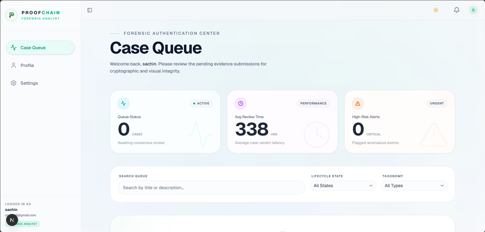 | **Deep Inspection (Dark Theme)**: Shows the queue of files requiring professional review. Analysts can flag suspicious metadata adjustments or anomalies in the uploaded files. |
| **Immutable System Audit** | 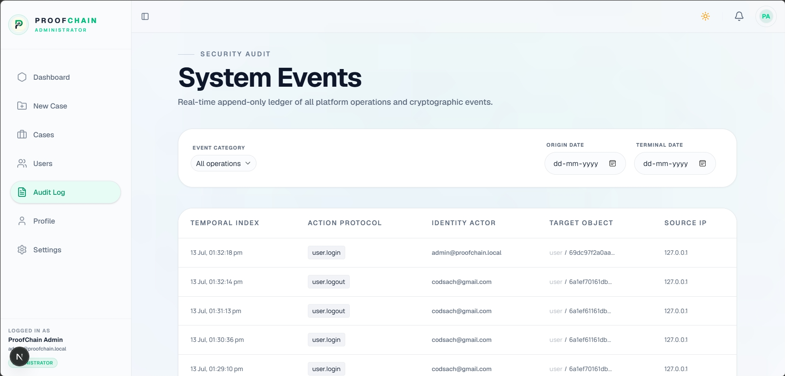 | **Administrative Log**: A list of all historical actions taken in the platform (e.g., login attempts, file downloads). Since it is linked to database actions, this audit trail cannot be manipulated or erased. |
| **Administrative Control** | 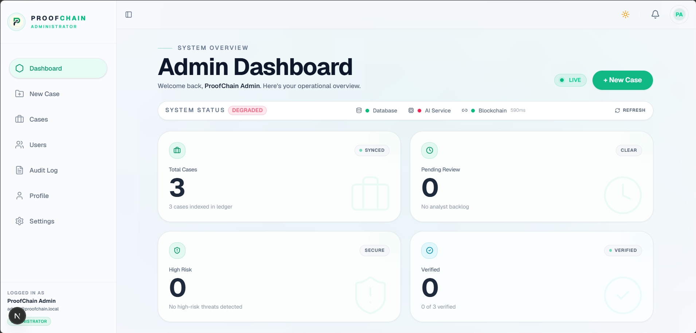 | **Admin Console**: Provides administrators with system statistics, user control panels, contract configuration details, and active server nodes telemetry. |
| **User Profile Page** | 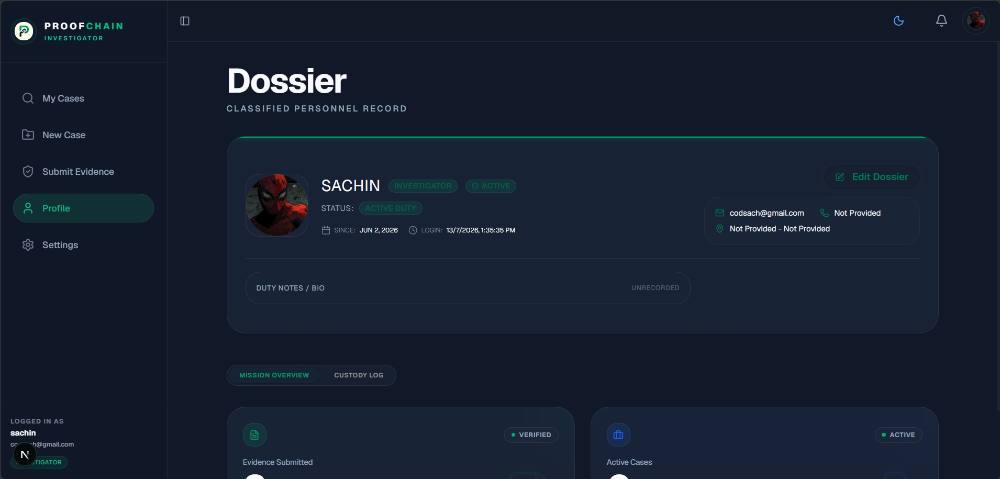 | **Classified Personnel Dossier**: Consists of investigator credentials, bio, department, location, assigned hardware, and role-specific stats. Its purpose is to serve as a secure profile and activity hub showing user details and role performance metrics (like cases submitted, verdicts issued, or actions audited). |

---

## 💡 Core Concepts Explained Simply

If you are new to blockchain or digital forensics, here is an explanation of the core technologies behind ProofChain:

### 1. Cryptographic Sealing (SHA-256 Fingerprint)
Every file has a "fingerprint" called a **hash** (specifically SHA-256). 
* Think of it as a mathematical seal.
* If a file is 10 Gigabytes or 1 Kilobyte, the hash is always a short 64-character text string (e.g., `e3b0c442...`).
* If someone edits even a single pixel in an image or adds a space to a document, the hash changes completely. 
* By matching the hash of a file today with the hash we recorded when it was collected, we can prove with 100% certainty that the file has not been altered.

### 2. Blockchain Anchoring (Polygon Blockchain)
A database on a standard computer can be edited by database administrators. To ensure absolute trust, we anchor the file fingerprints onto the **Polygon Blockchain**.
* A blockchain is a shared ledger that is copied across thousands of computers globally.
* Once a record is written to a blockchain, **it is impossible to edit, erase, or overwrite**.
* We write the file's hash, time of collection, and investigator details to the blockchain. Anyone can check this public ledger to verify that the evidence existed in its current form on that exact date.

### 3. Chain of Custody (Who, When, Where)
For evidence to be accepted in court, you must prove who handled it from the moment it was collected. ProofChain handles this automatically:
* Every time a user views, downloads, or edits evidence, the platform logs the action.
* The device's GPS coordinates are parsed and placed on an interactive map.
* This logs the physical path and the digital path of the evidence throughout its lifecycle.

### 4. AI-Assisted Integrity Scans
Forensic investigators use AI models (like Gemini) to look for anomalies.
* The platform automatically reviews metadata (such as camera types, file edit dates, and GPS coordinates).
* If a photo claims it was taken in 2026, but the digital metadata says it was edited in 2027, the AI highlights this inconsistency, raising the risk level to Medium or High.

---

## 🛠️ Technology Stack

ProofChain is built on modern web technologies:
* **Base Framework**: [Next.js 16](https://nextjs.org/) (built with React 19 and Webpack) for fast server-side rendering and routing.
* **Database**: [MongoDB](https://www.mongodb.com/) via the [Mongoose](https://mongoosejs.com/) library to store case metadata and logs.
* **Blockchain Integrations**: [Ethers.js v6](https://docs.ethers.org/) to read and write records to smart contracts.
* **Mapping**: [Leaflet](https://leafletjs.com/) and [React Leaflet](https://react-leaflet.js.org/) for geographic maps.
* **Two-Factor Authentication**: [otplib](https://github.com/yeojasing/otplib) for securing investigator and administrator logins.
* **Styling & Animations**: [TailwindCSS](https://tailwindcss.com/), [Framer Motion](https://www.framer.com/motion/), and [GSAP](https://gsap.com/) for fluid transitions.

---

## 💻 Local Setup & Installation

Follow these steps to run the application on your computer:

### 1. Prerequisites
Ensure you have the following installed on your machine:
* [Node.js](https://nodejs.org/) (Version 18 or newer)
* [MongoDB](https://www.mongodb.com/try/download/community) (either running locally or a free Atlas cloud cluster URI)

### 2. Environment Configurations
Create a new file named `.env.local` in the project root folder. Copy the configuration keys from your development settings:
```env
# Database URI
MONGODB_URI=mongodb://...

# Authentication Tokens
JWT_SECRET=your_secret_key
REFRESH_TOKEN_SECRET=your_refresh_key

# Blockchain Settings
NEXT_PUBLIC_CONTRACT_ADDRESS=0x...
POLYGON_RPC_URL=https://...
```

### 3. Install Dependencies
Open your terminal in the project root folder and run:
```bash
npm install
```

### 4. Start the Application
Launch the local development server:
```bash
npm run dev
```
Open your browser and navigate to **[http://localhost:3000](http://localhost:3000)**.

---
